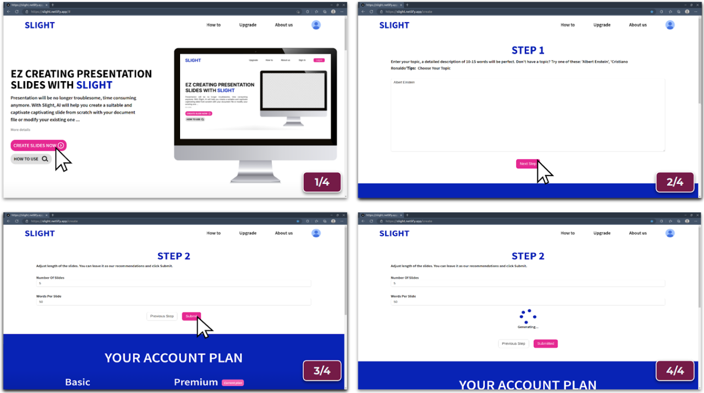
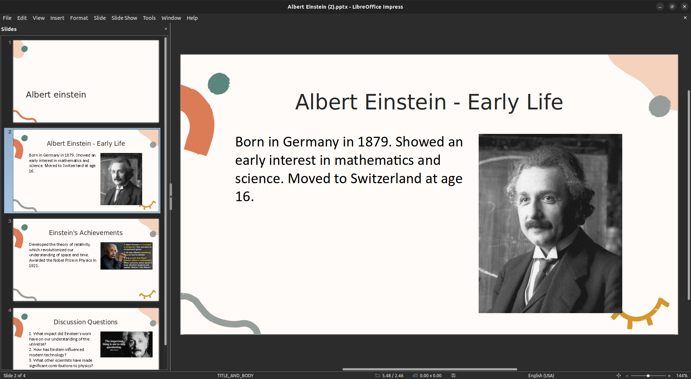

# slight-generation

## Update October 2023: 
- ⚠️ [Poe-api](https://github.com/ading2210/poe-api), which this project relied on, was stopped from being maintained since September 2023. Therefore, this project is currently not working.
- 🚧 We are looking for alternatives to fix this.

## Introduction
SLIGHT-GENERATION is a product aiming to help reducing the time and effort when making presentation slides. The name SLIGHT was combined from SLIDE(presentation) and LIGHT(fast and easy).

## Demo
This is a 4-step creating process on our deployed version:
- Step 1: Click `CREATE SLIDES NOW`
- Step 2: Topic: Type in the topic you want the presentaion to be about, then click `Next`
- Step 3: Additional settings: change anything if you want to, then click `Next`
- Step 4: Auto Generation: Wait for 1-2 minutes and a presentation will be automatically downloaded


#### Result
This presentation was produced with the topic "Albert Einstein" (other settings left as default).


```
However, since the deployment is not online currently, you can test it using command line.
```

### Test with CLI
Clone this repository
```
git clone https://github.com/nguyenthekhoig7/slight-generation.git
```
Install required packages
```
pip install -r requirements.txt
```
Run `main_test.py`
```
mkdir data
python main_test.py
```

### Reference 
- Python Poe API. Retrieved October 18, from https://github.com/ading2210/poe-api